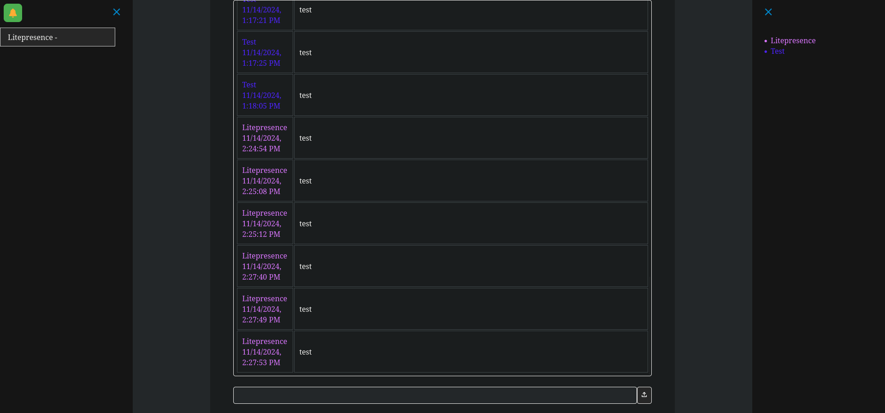
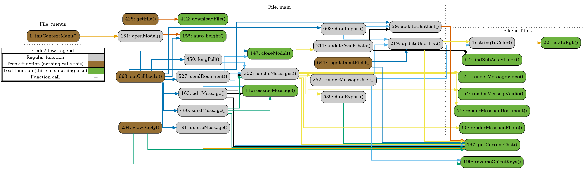

# EchoBot
### Telegram Multi-User Mirror Bot

EchoBot is a JavaScript application that uses the Telegram Bot API to allow multiple users to interact with Telegram under a single account. 

EchoBot provides private multi-user access to a single Telegram account. 

EchoBot removes the need to create additional accounts (and thus, additional phone numbers).

## Overview

The main interface of EchoBot (see screenshot below) mirrors Telegram chats, enabling multiple users to chat through one Telegram account. It supports messages, documents, photos, videos, and audio. The dark-themed UI features a chat list and topic list on the left, with a list of users in the current chat on the right.  It works with public groups, private groups, and private messages.  It even works in groups with subgroups.  



## Known Limitations

While EchoBot provides a convenient mirroring experience, it has some limitations:

1. **Message Persistence**: 
   - If EchoBot is offline, it will miss any messages sent during that time, even after restarting.
   
2. **Deletion Syncing**:
   - Message deletions in the official Telegram app are not reflected in EchoBot. However, message edits are synced successfully.
   
3. **No Chat History on Startup**:
   - Bots cannot access message history in Telegram, so EchoBot starts with an empty chat log. New messages are stored as JSON data, and files are saved as links to the Telegram server.
   
4. **Delayed Chat Initialization**:
   - EchoBot cannot initiate new chats. A chat appears in EchoBot only after a message is sent in the main Telegram app.
   
5. **Group and Subgroup Visibility**:
   - EchoBot does not detect groups or subtopics until a message is posted, at which point they are added to the EchoBot interface.
   
6. **Private Messaging**:
   - EchoBot cannot initiate private messages. However, if a user sends a private message to the bot, it will appear in EchoBot like a regular chat.

7. **Admin Required**:
   - The bot must be added by the admin of the group and given admin status, but no privileges required.

## Key Features

- **Single Account, Multiple Users**: Eliminates the need for multiple phone numbers or additional Telegram accounts.
- **UI Mirroring**: Displays real-time messages with user and timestamp indicators.
- **Automated Data Backup**: Message and chat backups are managed by a Python Falcon server, which saves data as JSON. This server must be running alongside EchoBot.
- **File and Media Support**: Supports multimedia files, stored as links to the Telegram server.
- **XSS Mitigation**: Uses DOMPurify to remove potential for script injection.

## Backup Server Setup

EchoBot includes an automated backup solution using a Python Falcon server. The server continuously saves chat data to a `backup.txt` file in JSON format. Users must run this server alongside EchoBot to ensure data persistence.

### Running the Falcon Server

1. Install Falcon:
   ```bash
   pip install falcon
   ```
2. Run the server:
   ```bash
   python backup_server.py
   ```
3. EchoBot will now automatically back up chat data by sending POST requests to the Falcon server at `/backup`. When the bot page is refreshed or reopened, it sends a GET request to the server to retrieve cached data.

## File Structure

EchoBot is organized into several JavaScript modules:

- **menus**: Contains functions for context menu operations.
- **main**: Handles core messaging functionality.
- **utilities**: Provides helper functions for colors, data manipulation, and message rendering.

## Function Overview

### menus

- **`initContextMenu()`**: Initializes the context menu (appears when right-clicking on messages), allowing message deletion and editing.

### main

- **`getFile()`**: Retrieves and downloads files.
- **`longPoll()`**: Continuously checks for new messages from Telegram to enable real-time updates.
- **`sendMessage()`**: Sends text messages.
- **`sendDocument()`**: Sends documents, images, videos, and audio in chat.
- **`editMessage()`**: Edits messages in response to changes in the main UI.  
   ***Note***: Only plain text messages can be edited.
- **`deleteMessage()`**: Allows messages to be deleted.

### utilities

- **`stringToColor()`**: Converts a user’s name to a unique color for easy tracking in chat.
- **`renderMessagePhoto()` / `renderMessageVideo()`**: Renders multimedia messages.
- **`getCurrentChat()`**: Retrieves the active chat session for display or messaging.

See also the call graph generated by `code2flow`:



## Installation

0. Go to @botfather on telegram and create a new bot; save the token info, which you will later paste into `main.js`.

1. Clone the repository:
    ```bash
    git clone https://github.com/squidKid-deluxe/EchoBot.git
    ```
2. Install dependencies:
   ```bash
   pip install falcon
   ```
3. Edit `main.js` to include your bot token by pasting it into the `''` following `const TOKEN =`.
4. Start the backup server:
   ```bash
   python backup_server.py
   ```
5. Open `index.html` in your web browser. (Internet Explorer is *not* supported)

### Usage

 - Add the bot to a public or private room and make it an admin with no privileges.

 - You can also send a private message to the bot to initiate dialog